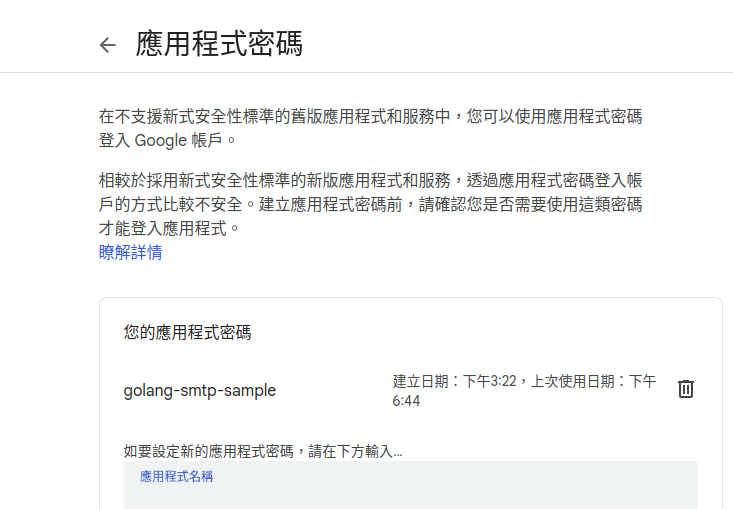

# golang smtp sample

This repository is for implementation sending email with golang use [net/smtp](https://pkg.go.dev/net/smtp)

## preparation

use gmail service account to create app call golang-stmp-sample

使用 google 的應用程式密碼



建立使用 smtp 的 secret

## 程式架構


## dependency graph

```shell
goda graph github.com/leetcode-golang-classroom/golang-smtp-sample/... | dot -Tsvg -o dependency-graph.svg
```


## dependency injection diagram

